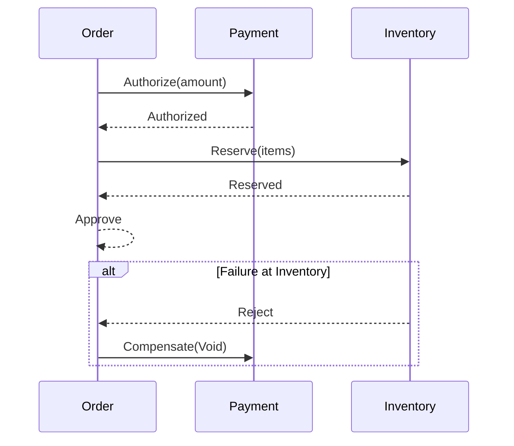

# Saga Pattern

Overview
- Coordinates a long-lived business transaction across services using local transactions and compensations.

When To Use
- Multi-step workflows requiring consistency without distributed 2PC (e.g., trip booking: reserve -> charge -> confirm).

Approaches
- Orchestration (central coordinator)
- Choreography (event-driven, no central brain)

Java/Spring Notes
- Orchestration via a workflow engine (e.g., Camunda/Temporal) or a coordinator service. Choreography with Kafka topics and compacted command/event streams.

Trade-offs
- Pros: Scalability, resilience; Cons: Complexity, compensations can be tricky.

Related
- [[Microservices Patterns]] • [[cqrs]] • [[event-sourcing]] • [[api-gateway]]

## Orchestration Flow (example)
- Step 1: Order Service creates order (PENDING) and requests Reserve Payment.
- Step 2: Payment Service authorizes charge; on success, request Reserve Inventory.
- Step 3: Inventory Service reserves stock; on success, mark Order APPROVED.
- Failure: trigger compensations (release inventory, void payment) and mark Order FAILED.



## Choreography (event‑driven)
- Services publish domain events; others react with local transactions.
- Use a clear event contract and idempotent handlers; avoid cyclic reactions.

```java
// Example event handler in Inventory
@KafkaListener(topics = "order-events")
public void on(OrderAuthorized e) {
  if (reserve(e.items())) publish(new InventoryReserved(e.orderId()));
  else publish(new InventoryRejected(e.orderId()));
}
```

## Orchestration (workflow engine)
- Central coordinator drives the steps and compensations.
- Temporal/Camunda model retries, timeouts, and compensation logic explicitly.

```java
// Temporal workflow sketch
@WorkflowInterface
public interface OrderWorkflow { @WorkflowMethod void execute(OrderInput in); }

public class OrderWorkflowImpl implements OrderWorkflow {
  private final Activities acts = Workflow.newActivityStub(Activities.class);
  public void execute(OrderInput in) {
    try {
      acts.authorizePayment(in);
      acts.reserveInventory(in);
      acts.finalizeOrder(in);
    } catch (Exception ex) {
      Workflow.newDetachedCancellationScope(() -> acts.compensate(in)).run();
      throw ex;
    }
  }
}
```

## Operational Concerns
- Idempotency: dedupe by `sagaId`/step; make compensations safe on repeats.
- Timeouts: detect and recover stuck steps; dead‑letter and manual recovery flows.
- Visibility: emit a saga state stream for monitoring and debugging.

## Testing
- Unit: compensation logic and edge cases per step.
- Integration: happy path and each failure point; verify compensations.
- Chaos: random step failures to ensure system convergence.

## Pitfalls
- Over‑choreography creates implicit coupling and hard‑to‑debug loops.
- Compensations are not true rollbacks; design for business acceptability.

## See Also
- [[cqrs]] • [[event-sourcing]] • [[Microservices Patterns]]

## Interview Checklist
- Define saga and why it replaces 2PC in microservices.
- Contrast orchestration vs. choreography with pros/cons.
- Show compensation examples and idempotency considerations.
- Explain timeouts, retries, DLQs, and observability of saga state.
- Mention tooling (Temporal/Camunda) and event‑driven approaches.

## Practice Questions
- In a payment‑then‑inventory saga, payment succeeds but inventory reservation fails. What compensations run, and how do you ensure idempotency and consistency across retries?
- Answer Outline: void/credit payment, release partial reservations, mark order FAILED; dedupe by sagaId + step, idempotent compensations, retry with backoff, DLQ for manual intervention.
- When would you prefer choreography over orchestration, and how would you avoid cyclic event flows and tight coupling?
- Answer Outline: simpler domains with few participants; use clear event contracts and bounded contexts, define terminal events, avoid ping‑pong with correlation ids and saga state topics.
