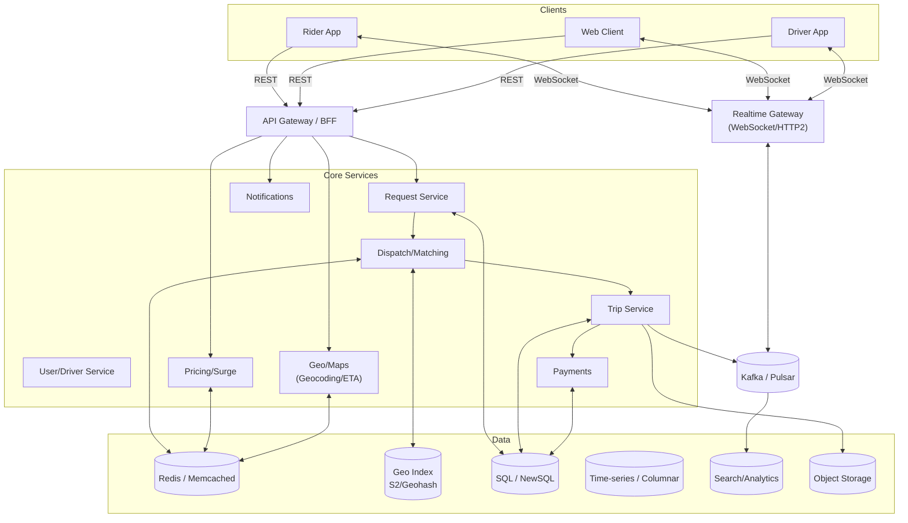
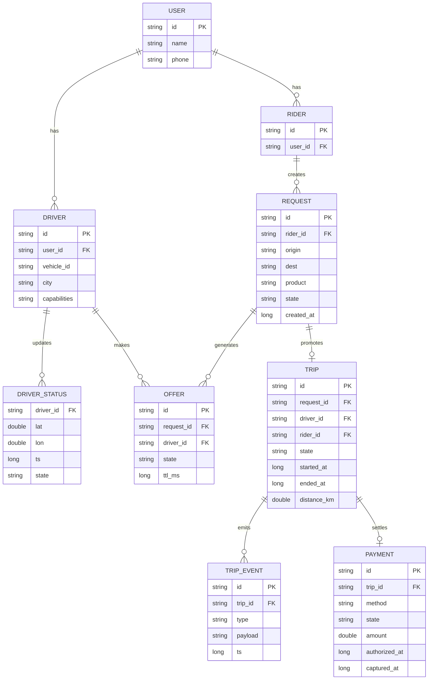
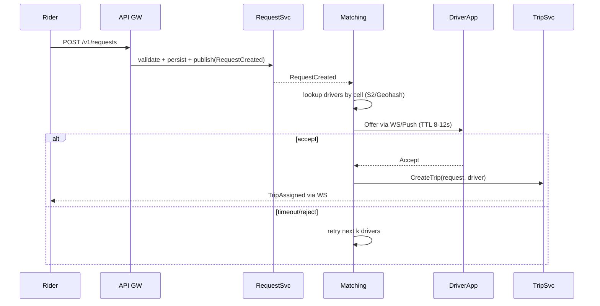
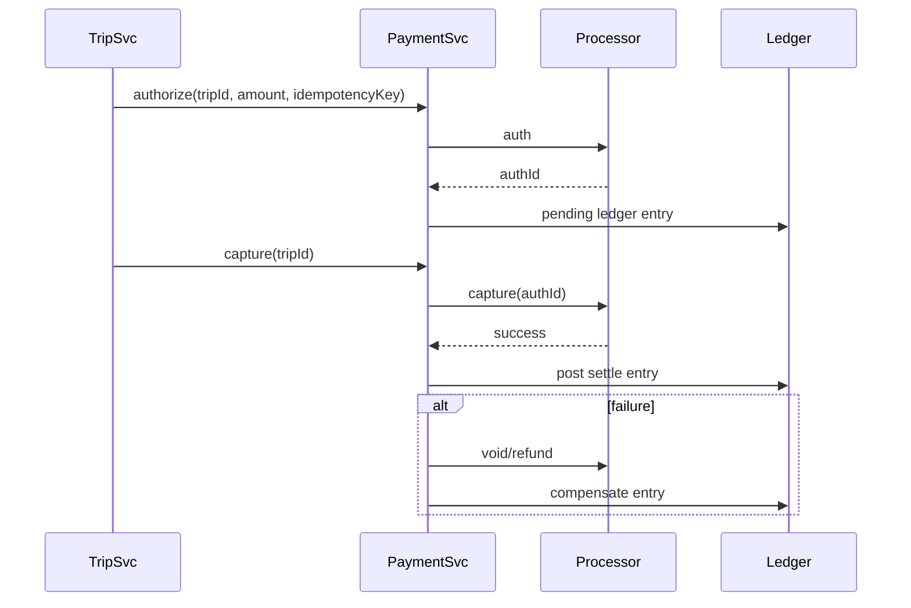
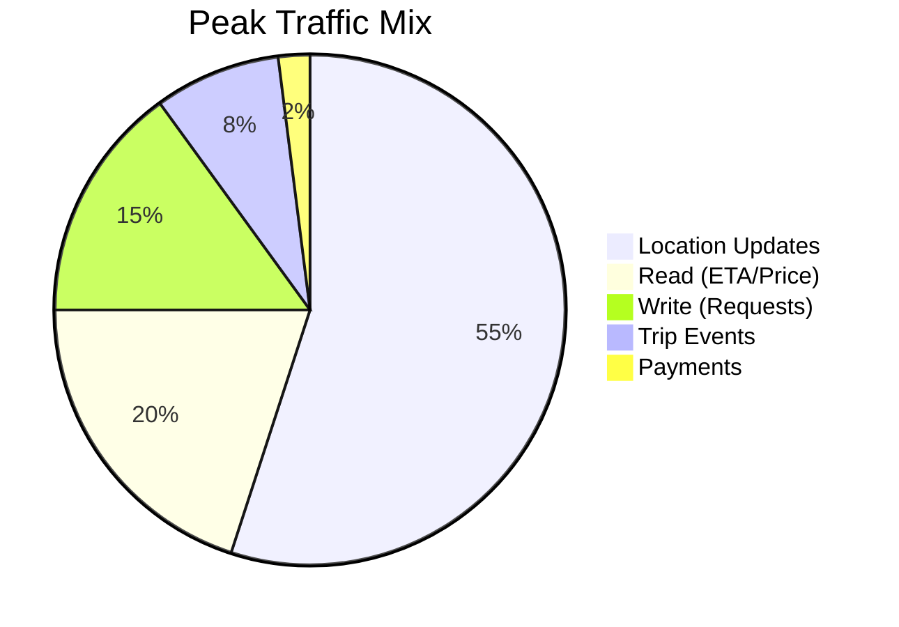

# Uber System Design (Java)

Overview
- Design a ride-hailing platform enabling request -> match -> trip -> pay with
  high availability, low latency, and global scale.
- Keep the solution interview-ready: crisp requirements, clear flows, justified
  trade-offs, and diagrams.

Interview Script (Quick Cheat Sheet)
- Start: clarify scope (rides only), users, cities, and target SLAs.
- Requirements: list functional and non-functional; confirm out-of-scope.
- Scale: pick a profile (city vs global) and quantify RPS and storage.
- Draw: high-level boxes (clients, gateway, services, data, realtime).
- Deep dive: matching and geo index; why the approach works.
- Data: key entities and events; idempotency for writes.
- Reliability: retries, timeouts, circuit breakers, sagas, degradation.
- Close: trade-offs, extensions (pooling, car types), and open risks.

Functional Requirements
- Rider: create/cancel request, see ETA/price, track driver, pay, rate.
- Driver: go online/offline, accept/decline, navigate, end trip, earnings.
- Matching: find nearest suitable driver, handle timeouts/retries.
- Pricing: upfront fare plus surge; final fare computed post-trip.
- Maps/Geo: geocoding, routing, ETA, distance, geofence.
- Payments: capture, refund, wallet; fraud checks.
- Notifications: push/SMS/in-app events for key states.

Non-Functional Requirements
- Availability: 99.99% for core ride flows. Latency: P95 < 200 ms for match,
  < 100 ms for ETA/price reads. Data durability for trips/payments.
- Scale: tens of millions DAU; millions of concurrent websockets; peak
  100-200k RPS read/write mix in hotspots.
- Consistency: accept eventual consistency for feeds/maps; strong enough for
  money movement and trip state transitions.

Back-Of-Envelope Estimates (assumptions)
- Active drivers: 1M; online concurrently: 200k; location update every 3 s ->
  ~66k updates/s. Trip starts: 20k/s peak; requests: 50k/s peak.
- Storage: trip events ~1 KB each; 100 events/trip -> 100 KB/trip. For 10M
  trips/day -> ~1 TB/day raw events (before compression/retention tiering).

Capacity Profiles (tune during interview)
- Small City: 20k DAU, 2k online drivers, location every 5 s -> ~400 updates/s.
  Peak requests 500/s; match p95 < 250 ms is acceptable.
- Large Metro: 300k DAU, 30k online drivers, location every 3 s -> 10k updates/s.
  Peak requests 5k/s; trips 2k/s; websocket fan-out to 100k sessions.
- Global: 50M DAU, 1M online drivers, location every 3 s -> 333k updates/s.
  Requests 50k/s; trips 20k/s; analytics ingestion in TB/day.

Capacity Math Sidebar (illustrative)
- Driver location bandwidth: updates/s * payload. Example 10k/s * 300 B -> 3 MB/s
  per metro (~10.8 GB/h). With gzip and batching, reduce by 3-5x.
- Offer retries: acceptance 40% in 8 s. Expected tries ~1/0.4 = 2.5. Keep
  k-neighborhood driver pool > 5x expected to cover tail.
- Cache sizing: 30k drivers * 50 B metadata -> ~1.5 MB per city cell tier.
- Storage: 10M trips/day * 100 KB events -> ~1 TB/day raw; 3x compaction
  yields ~350 GB/day; move cold after 7-30 days.

High-Level Architecture

Core Domains And Responsibilities
- Request Service: validate, persist request, publish event, start SLA timers.
- Matching: maintain active-driver proximity index; score/assign, handle retries.
- Trip Service: authoritative trip state machine; emits events; idempotent updates.
- Pricing/Surge: upfront quote, dynamic surge by cell/time; post-trip fare.
- Geo/Maps: geocode, ETA, routing abstraction over provider(s).
- Payments: tokenization, auth/capture/refund; ledger entries; reconciliation.
- Realtime GW: websockets for location/notifications; fan-out to sessions.

APIs (Sketch)

| API             | Method | Path                           | Notes                           |
| --------------- | ------ | ------------------------------ | ------------------------------- |
| Create Request  | POST   | `/v1/requests`                 | origin, dest, products, riderId |
| Cancel Request  | POST   | `/v1/requests/{id}:cancel`     | reason codes                    |
| Quote           | GET    | `/v1/quotes?origin=..&dest=..` | upfront price, ETA              |
| Go Online       | POST   | `/v1/drivers/{id}:online`      | lat, lon, cap, product          |
| Location Update | POST   | `/v1/drivers/{id}/location`    | batched, every 2-5 s            |
| Accept/Reject   | POST   | `/v1/offers/{id}:accept`       | driver side                     |
| Trip Events     | POST   | `/v1/trips/{id}/events`        | start, pause, end               |
| Pay             | POST   | `/v1/trips/{id}:pay`           | idempotency key required        |

Data Model (ER)

Matching Flow

Location And Proximity Indexing
- Partition the world into fixed cells using S2 or Geohash (precision ~150-500 m
  in cities). Maintain Redis sorted sets per cell keyed by driverId with score as
  last update timestamp or a composite score (distance + decay).
- Drivers send location every 2-5 s (batch to reduce network). Keep a 15-30 s
  TTL; evict stale drivers. For search, probe home cell + k neighbors.
- For ETA, ask GEO routing with batched matrix API when needed; cache results for
  30-60 s per corridor.

Surge And Pricing
- Surge: compute multiplier per cell and product using short-window demand/supply
  ratios and queue times. Smooth with EWMA and clamp within [1.0, 3.0].
- Upfront Quote: base + time + distance priced on predicted route/ETA; include
  surge and fees. Persist quoteId with expiry; reconcile against final meter.
- Post-Trip: recompute using actual distance/duration; handle adjustments and
  receipts (store in object storage).

Payments Orchestration (Saga)

Realtime Delivery
- WebSocket connections terminate at Realtime GW; sessions keyed by userId and
  deviceId. Use sticky routing via session store (Redis) and fan-out by topic
  (tripId, userId, city). Backpressure with bounded mailboxes per session.

Storage Choices
- OLTP: trips/requests/payments in SQL/NewSQL (e.g., Postgres, CockroachDB,
  Spanner) for transactions and secondary indexes. Shard by city or riderId.
- High-write feeds: trip events and driver pings in Kafka -> time-series store
  (Bigtable/Cassandra/ClickHouse) for analytics/ETA training.
- Caching: Redis for proximity, quotes, session state, rate limits.
- Search: Elastic/OpenSearch for driver/rider lookups and support tooling.

Partitioning And Sharding
- Geo sharding by city/market; within city use hash on riderId/requestId.
- Proximity index partitions by cell id. Rebalance hotspots by splitting cells
  or adding per-product buckets in busy downtowns.

Consistency, Idempotency, And Resilience
- Idempotency keys for create request, payment, and trip event posts.
- [[saga-pattern]] for trip/payments; [[circuit-breaker]] around maps, payments,
  notifications; retries with jitter; dedupe on consumer side.
- [[cqrs]] for trip read views: materialize denormalized aggregates for fast UI.

Observability And Ops
- Metrics: match latency, offer acceptance rate, driver online counts, queue
  times, surge distribution, payment failures.
- Tracing: propagate traceId across GW -> services -> processor.
- Logging: structured logs with tripId/requestId; PII scrubbing.

Security And Compliance
- Tokenize cards; do not store PAN. Encrypt PII at rest; TLS in transit.
- RBAC for admin ops; audit logs. GDPR: delete/export rider data on request.

Rate Limiting And QoS
- Per-user and per-IP rate limits at GW. Priority lanes for critical flows
  (accept offer, trip updates). Apply bulkheads per dependency.

Failure Scenarios To Discuss
- Maps provider outage -> degrade to cached ETA or distance-based fallback.
- Payments partial outage -> allow trip completion; retry capture; hold balance.
- City hotspot overload -> shed non-critical reads, increase search radius/TTL.

Testing Checklist
- Property tests for state machine transitions (trip/request/offers).
- Soak tests for WebSocket fan-out and backpressure.
- Load tests: 100k/s location updates; 20k/s match cycles; p95 latency goals.
- Chaos: kill matching shards, degrade maps, network partitions.

Simple Cost/Traffic Split (Illustrative)

Tech Notes (Java)
- Spring Boot microservices; gRPC for service-to-service; REST for clients.
- Kafka Streams/Flink for surge, ETA models, and materialized views.
- Redis for proximity/session/rate-limit; Postgres/CockroachDB for OLTP; ClickHouse
  or Bigtable for analytics; S3-compatible object store for receipts.

Interview Pointers
- Start with requirements and scale, draw the high-level diagram, then go deep
  on matching, geo indexing, surge, and payments. Call out idempotency, sagas,
  and degradation strategies. Quantify estimates and close with trade-offs.

Related
- [[Java Design Patterns Hub]]
- [[Tech Stack Profile]]
- [[scalability-checklist]]
- [[cap-theorem]]
- [[microservices-patterns]]
- [[cqrs]]
- [[event-sourcing]]
- [[api-gateway]]
- [[circuit-breaker]]
- [[saga-pattern]]
- [[java-implementation-notes]]
