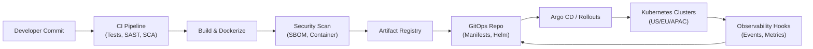

# CI CD And Deployments

Pipeline automation keeps Aurora Orders deployable multiple times per day while meeting compliance and reliability goals.

## CI Workflow
- **Trigger:** Git merge request; enforce code owners, static analysis, unit/integration tests, security scans (SAST, SCA).
- **Build:** Gradle/Maven builds with reproducible Docker images (BuildKit/kaniko), SBOM generation, dependency checks.
- **Testing:** Contract tests (Spring Cloud Contract), containerized integration tests (Testcontainers), load smoke tests via k6 for critical APIs.
- **Artifacts:** Push images to container registry with immutable tags (commit SHA + semantic version); sign via Cosign.

## CD Workflow
- **Promotion:** Tag release candidate after CI success; create deployment PR in GitOps repo referencing new image.
- **Progressive Delivery:** Argo Rollouts canary (10% → 30% → 100%) with automated metrics (error rate, latency) gating; rollback on burn-rate alerts.
- **Feature Flags:** LaunchDarkly/Unleash for decoupling deploy vs. release; maintain flag lifecycle runbooks.
- **Compliance:** Change tickets auto-generated with metadata (Jira, ServiceNow); approvals enforced per environment.

## CI/CD Pipeline Diagram

## Operational Controls
- **Observability Hooks:** Pipeline publishes deployment events to monitoring for correlation.
- **Chaos in CI:** Nightly chaos suites on staging; ensures resilience before prod.
- **Recovery:** Automated rollback scripts; database migration guardrails (expand/migrate/contract with preflight checks).
- **Cost Monitoring:** Track pipeline runtime costs, auto-scale runners, and clear caches.

## Interview Talking Points
- Describe how pipeline enforces security (container scanning, SBOM, signing).
- Explain feature flag governance and avoiding flag debt.
- Discuss incident scenario: failed canary leading to rollback; metrics used to detect and remediate.

## Related Notes
- [[Kubernetes Operations]]
- [[Delivery And Operational Excellence]]
- [[Concept Application Overview]]
