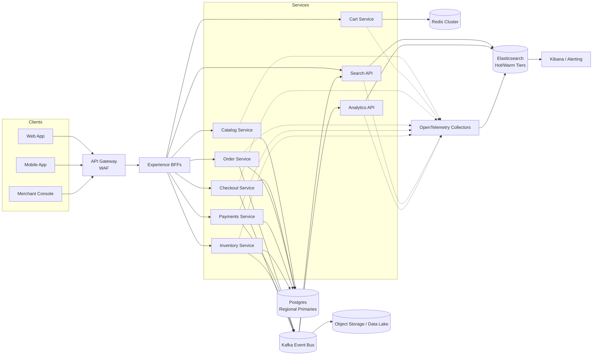
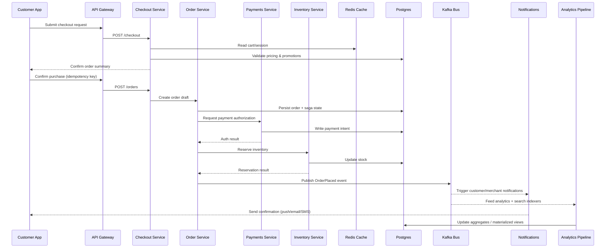

# Concept Application Overview

**Case Study: Aurora Orders Platform**  
Enterprise-grade order management for a global retail marketplace. Handles catalog search, checkout, fulfillment orchestration, and post-purchase analytics across regions.

See [[Platform Stack Index]] for the companion notes on each supporting technology.

## Business Capabilities
- Customer-facing APIs for browsing, cart, checkout, and order history.
- Merchant tools for inventory sync, pricing, promotions, and analytics.
- Fulfillment pipeline connecting warehouses, 3PLs, and carrier integrations.
- Observability and compliance dashboards for operations teams.

## High-Level Architecture
- **Edge & API Layer:** API Gateway with rate limiting, auth, and request shaping. BFFs for web/mobile experiences.
- **Core Services:** Java/Spring Boot microservices per bounded context (Catalog, Cart, Checkout, Orders, Payments, Inventory).
- **Data & Storage:** [[Postgres Data Architecture]] for transactional workloads; [[Redis Cache Strategy]] for session/cart caching and hot lookups; [[Elasticsearch Search Analytics]] for search relevance and analytics queries.
- **Async & Integration:** Kafka (orders, inventory) with DLQs; outbox pattern from services to integrate with downstream analytics and data lake.
- **Observability:** [[Kibana Observability Stack]] on top of Elastic stack; distributed tracing via OpenTelemetry.
- **Platform & Delivery:** [[Kubernetes Operations]] for deployment, autoscaling, and service mesh; [[CI CD And Deployments]] for pipeline automation and GitOps.
- **Infrastructure:** Multi-region setup with cloud load balancers, CDN, and WAF; Terraform and policy-as-code (OPA) to enforce standards.

### System Architecture Diagram

## Scaling & Resilience Tactics
- Regional shards for Postgres with read replicas and partitioned tables; global read-only follower for analytics.
- Redis Cluster for caching with auto-failover and persistence (AOF).
- Search cluster sized for document count + query per second (QPS) goals; index pipelines with change data capture.
- Kubernetes horizontal pod autoscaler (HPA) plus KEDA for event-driven scale.
- Chaos experiments on queue latencies, database failovers, and cache node losses.

## Interview Talking Points
- Tie customer requirements to technology choices (e.g., Redis for low-latency cart reads, Elastic for search facets).
- Walk through an order lifecycle: API request → service fan-out → saga/orchestration → async tracking updates.
- Discuss operational runbooks: incident triage, SLO dashboards, canary deploys, cost and capacity governance.
- Highlight security posture: OAuth2/OIDC, row-level security in Postgres, encryption at rest, secrets management.

## Next Steps
- Deep dives: [[Redis Cache Strategy]], [[Postgres Data Architecture]], [[Elasticsearch Search Analytics]], [[Kibana Observability Stack]], [[Kubernetes Operations]], [[CI CD And Deployments]].
- Extend with customer personalization, ML recommendations, or data platform integrations as needed.

## Order Lifecycle (Sequence Diagram)

