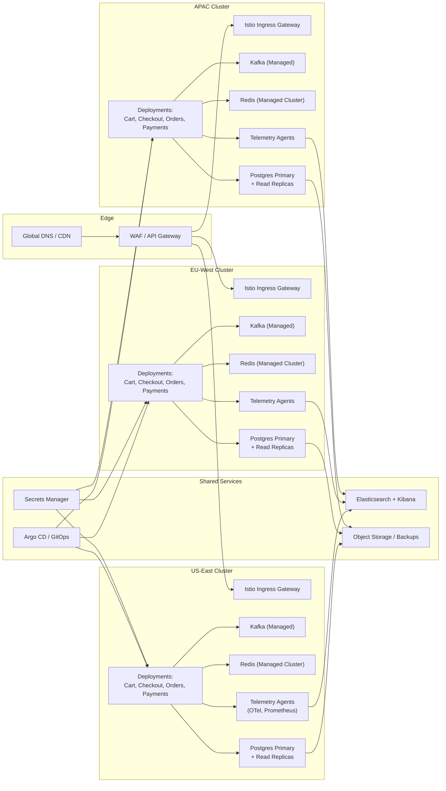

# Kubernetes Operations

Aurora Orders runs on Kubernetes to deliver consistent deployments, autoscaling, and multi-region resilience.

## Cluster Topology
- Regional clusters (US, EU, APAC) managed via managed Kubernetes (GKE/EKS/AKS) with 3 AZ worker pools.
- Namespaces per environment (dev, staging, prod) and per platform component (core services, data plane, observability).
- Service mesh (Istio/Linkerd) for mTLS, traffic shaping, and observability.

## Deployment Patterns
- GitOps with Argo CD: manifests + Helm charts stored in dedicated repo; promote via pull requests.
- Progressive delivery: canary releases (Argo Rollouts) with automated metrics analysis; blue/green for critical services.
- Workload types: `Deployment` for stateless services, `StatefulSet` for Kafka/Redis (managed services when possible), `CronJob` for batch tasks.

## Scaling & Resilience
- HPA based on CPU, memory, and custom metrics (request rate, queue depth); KEDA adds event-driven scale from Kafka lag.
- Pod disruption budgets to protect availability during upgrades.
- Multi-cluster services with global load balancer + DNS; use traffic splitting for regional failover.
- Chaos testing: simulate node drain, eviction, pod crash, network latency using Litmus or Chaos Mesh.

## Platform Operations
- Centralized secrets via external secrets operator syncing from Vault/Secret Manager.
- Policy enforcement: Gatekeeper/OPA for security (no privileged pods, approved images).
- Observability: OpenTelemetry collector as DaemonSet, Prometheus/Grafana for infra metrics, logs shipped to Elastic.
- Cost controls: cluster autoscaler, spot/preemptible pools for stateless workloads, resource quota governance.

## Deployment Topology

## Interview Talking Points
- Detail deployment pipeline from commit → build → security scan → GitOps sync → progressive rollout.
- Explain how you ensure cluster multi-tenancy and security boundaries.
- Discuss incident response: detecting failed deploy, automated rollback, postmortem integration.

## Related Notes
- [[CI CD And Deployments]]
- [[High-Traffic Resilience]]
- [[Delivery And Operational Excellence]]
- [[Concept Application Overview]]
